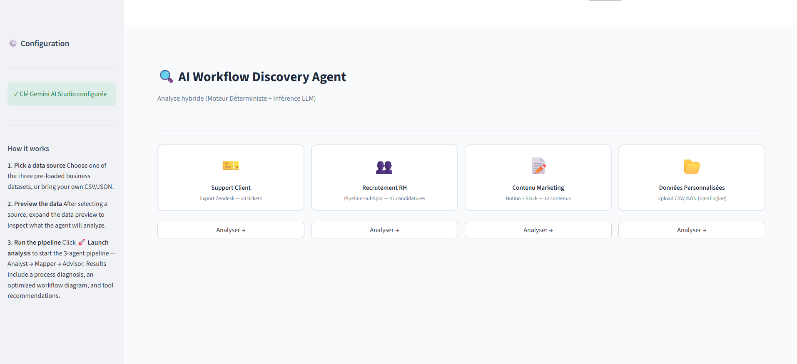

(Scroll down pour la version française)

---
<div align="center">  </div>

# AI Workflow Discovery Agent

This repository contains a hybrid business process analysis system. The architecture couples a deterministic clustering engine (NLP) with a multi-agent LLM inference pipeline to diagnose operational inefficiencies and design optimized automation architectures.

## 🏗 System Architecture

The system is built on the principle of Separation of Concerns, dividing heavy processing, logical orchestration, and the presentation layer.

```text
├── agents/
│   ├── agent_analyst.py      # ROI calculation and diagnosis
│   ├── agent_mapper.py       # Process architecture generation
│   └── agent_advisor.py      # Tech stack selection
├── data/                     # JSON/CSV demonstration files
├── assets/
│   └── style.css             # Presentation layer isolation
├── app.py                    # Internal API Gateway and Streamlit UI
├── data_engine.py            # HDBSCAN clustering engine
├── schemas.py                # Pydantic data contracts
├── workflow_viz.py           # Graphviz rendering engine (SVG)
├── Dockerfile                # Environment configuration (Python 3.10-slim)
├── .dockerignore             # Build filters
└── requirements.txt          # Python dependencies

**Deterministic Engine (DataEngine):**

   -Ingests raw exports (CSV/JSON).
   -Vectorizes text via sentence-transformers (all-MiniLM-L6-v2) on CPU.
   -Applies the HDBSCAN clustering algorithm to isolate noise and semantically group process recurrences.
   -Extracts mathematical centroids to reduce the payload sent to the LLM.

**Multi-Agent Pipeline (instructor + Gemini 3.0 Flash):**

   -Analyst Agent: Evaluates frictions, the ratio of manual steps, and calculates the potential ROI of automation.
   -Mapper Agent: Receives the diagnosis and generates a directed acyclic graph (DAG) representing the optimized target workflow.
   -Advisor Agent: Receives the workflow and selects the implementation technology stack (tools, complexity, priority).

**Strict Validation (Pydantic):**

   -Zero manual parsing of probabilistic JSON. Data transfers between agents and the interface are guaranteed by strict data contracts (schemas.py).

**Presentation & Rendering Layer (Streamlit + Graphviz):**

   -User interface decoupled from business logic.
   -Dynamic translation of Pydantic objects into interactive SVG diagrams via graphviz.


## ⚙️ **Deployment (Docker)**
The application is containerized to guarantee environment idempotency, especially for system dependencies like Graphviz.

### Prerequisites
Docker installed.

A Google AI Studio API key (GOOGLE_AI_STUDIO_KEY).

### Local Execution
Clone the repository:

Bash
git clone <https://github.com/Maxime-Gagne/AI_Workflow_Discovery_Agent>
cd <workflow_discovery_agent>
Configure environment variables:

**Create a .env file at the root:**
GOOGLE_AI_STUDIO_KEY=your_key_here

**Build and run the container:**

Bash
docker build -t ai_workflow_agent .
docker run -p 7860:7860 --env-file .env ai_workflow_agent
Access the interface: http://localhost:7860

🔒 Security and Constraints
The LLM (Gemini 3.0 Flash) is queried in GEMINI_JSON mode via instructor, forcing structured output without formatting hallucinations.

HDBSCAN processing is executed locally (or on the container's host instance); only aggregated metrics and centroids are sent to the LLM API, limiting token consumption and securing raw data.


----------------------------------------------------------------------------------------------------


# AI Workflow Discovery Agent

Ce dépôt contient un système hybride d'analyse de processus métier. L'architecture couple un moteur de clustering déterministe (NLP) à un pipeline d'inférence LLM multi-agents pour diagnostiquer les inefficacités opérationnelles et concevoir des architectures d'automatisation optimisées.

## 🏗 Architecture du Système

Le système est construit selon le principe de séparation des préoccupations (Separation of Concerns), divisant le traitement lourd, l'orchestration logique et la couche de présentation.

├── agents/
│   ├── agent_analyst.py      # Diagnostic et calculs de ROI
│   ├── agent_mapper.py       # Génération d'architecture de processus
│   └── agent_advisor.py      # Sélection de la stack technologique
├── data/                     # Fichiers de démonstration JSON/CSV
├── assets/
│   └── style.css             # Isolation de la couche de présentation
├── app.py                    # API Gateway interne et UI Streamlit
├── data_engine.py            # Moteur de clustering HDBSCAN
├── schemas.py                # Contrats de données Pydantic
├── workflow_viz.py           # Moteur de rendu Graphviz (SVG)
├── Dockerfile                # Configuration de l'environnement (Python 3.10-slim)
├── .dockerignore             # Filtres de build
└── requirements.txt          # Dépendances Python

1. **Moteur Déterministe (`DataEngine`)** :
   - Ingère des exports bruts (CSV/JSON).
   - Vectorise le texte via `sentence-transformers` (`all-MiniLM-L6-v2`) sur CPU.
   - Applique l'algorithme de clustering **HDBSCAN** pour isoler le bruit et regrouper sémantiquement les récurrences de processus.
   - Extrait les centroïdes mathématiques pour réduire le payload envoyé au LLM.

2. **Pipeline Multi-Agents (`instructor` + Gemini 3.0 Flash)** :
   - **Agent Analyste** : Évalue les frictions, le ratio d'étapes manuelles et calcule le ROI potentiel de l'automatisation.
   - **Agent Mapper** : Reçoit le diagnostic et génère un graphe acyclique dirigé (DAG) représentant le workflow cible optimisé.
   - **Agent Advisor** : Reçoit le workflow et sélectionne la pile technologique (outils, complexité, priorité) d'implémentation.

3. **Validation Stricte (Pydantic)** :
   - Zéro parsing manuel de JSON probabiliste. Les transferts de données entre les agents et l'interface sont garantis par des contrats de données stricts (`schemas.py`).

4. **Couche de Présentation & Rendu (Streamlit + Graphviz)** :
   - Interface utilisateur découplée de la logique métier.
   - Traduction dynamique des objets Pydantic en diagrammes SVG interactifs via `graphviz`.

## ⚙️ Déploiement (Docker)

L'application est conteneurisée pour garantir l'idempotence de l'environnement, notamment pour les dépendances système comme Graphviz.

### Prérequis
- Docker installé.
- Une clé API Google AI Studio (`GOOGLE_AI_STUDIO_KEY`).

### Exécution locale

Cloner le dépôt :
   ```bash
   git clone <https://github.com/Maxime-Gagne/AI_Workflow_Discovery_Agent>
   cd <workflow_discovery_agent>
